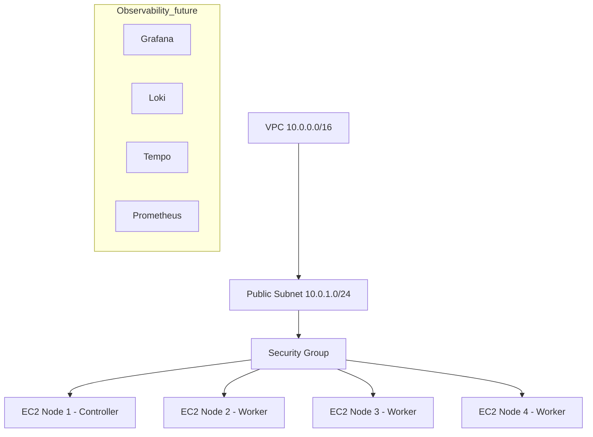

# Terraform k0s Staging Infrastructure

This repository provides a fully modular Infrastructure-as-Code (IaC) setup to deploy a **4-node k0s Kubernetes staging cluster** on AWS EC2.  
The environment is designed for testing Kubernetes components, observability tools, service mesh features, and cluster behaviour before moving to a production-grade EKS environment.

---

# 1. Overview

The staging infrastructure consists of:

- **1 VPC** (CIDR: `10.0.0.0/16`)
- **1 Public Subnet** (CIDR: `10.0.1.0/24`)
- **1 Security Group**, including rules for:
  - SSH (22)
  - Kubernetes API (6443)
  - NodePort range (30000–32767)
  - Grafana (3000)
  - Loki (3100)
  - Tempo (4317, 4318)
  - Prometheus (9090)
  - Internal cluster communication
- **4 EC2 Instances** (1 control-plane + 3 worker nodes)  
  These nodes will later be provisioned using **Ansible** to install k0s.
- All resources are fully modular:
  - `network/`
  - `security/`
  - `compute/`

### Architecture Diagram



---

# 2. Deployment

Follow the steps below to deploy the staging environment.

---

## 2.1 Generate SSH Key Pair

From the root of the repository, generate a new key pair inside the `key_pair/` directory.

### Linux / macOS / WSL:
```bash
ssh-keygen -t rsa -b 4096 -f key_pair/k0s_key
```

### Windows PowerShell:
```powershell
ssh-keygen -t rsa -b 4096 -f ".\key_pair\k0s_key"
```

Only the **public** key is used by Terraform.  
The private key should **never** be committed to Git.

---

## 2.2 Configure Terraform Variables

Terraform variable definitions are located in:

```
terraform/terraform.tfvars
```

Ensure your public key path is correct:

```tf
public_key_path = "../key_pair/k0s_key.pub"
```

---

## 2.3 Deploy the Infrastructure

Navigate into the Terraform directory:

```bash
cd terraform
```

Initialize Terraform:

```bash
terraform init
```

Validate configuration:

```bash
terraform validate
```

View the plan:

```bash
terraform plan
```

Apply the infrastructure:

```bash
terraform apply -auto-approve
```

---

## 2.4 Outputs

Terraform will output:

- Public IPs of the EC2 instances  
- Private IPs inside the VPC subnet

These will be used later in the Ansible inventory to install k0s.

---

## 2.5 Connect to EC2 Instances

Use the private key generated earlier:

```bash
ssh -i key_pair/k0s_key ubuntu@<PUBLIC-IP>
```
---

# 📌 Notes

- Do **not** commit private keys. `.gitignore` already protects them.
- This environment is meant for **staging, testing, and education**, not production.
